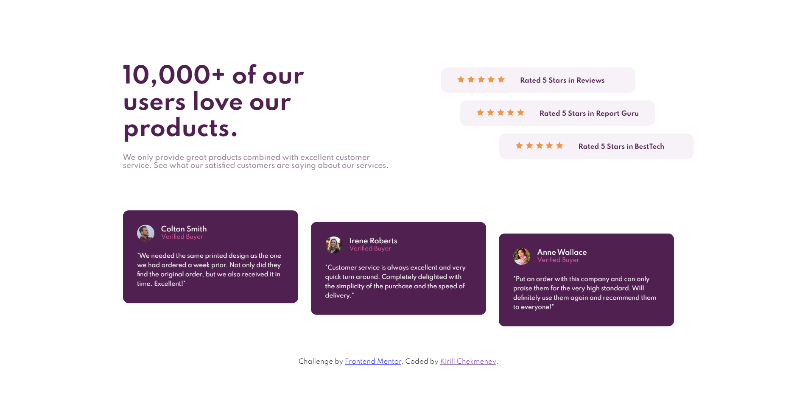

# Frontend Mentor - Social proof section solution

This is a solution to the [Social proof section challenge on Frontend Mentor](https://www.frontendmentor.io/challenges/social-proof-section-6e0qTv_bA). Frontend Mentor challenges help you improve your coding skills by building realistic projects. 

## Table of contents

- [Overview](#overview)
  - [The challenge](#the-challenge)
  - [Screenshot](#screenshot)
  - [Links](#links)
  - [Built with](#built-with)
- [Author](#author)

## Overview

### The challenge

Users should be able to:

- View the optimal layout for the section depending on their device's screen size

### Screenshot

### Links

- Solution URL: [https://github.com/skyrimer/Social-proof-section.git](https://github.com/skyrimer/Social-proof-section.git)
- Live Site URL: [https://pensive-babbage-ed7429.netlify.app](https://pensive-babbage-ed7429.netlify.app)

### Built with
- HTML5
- SCSS
- Flexbox
- Mobile-first workflow
## Author

- Website - [Kirill Chekmenev](https://xenodochial-clarke-834e2f.netlify.app)
- Frontend Mentor - [@skyrimer](https://www.frontendmentor.io/profile/skyrimer)
- Instagram - [@silent_kirill](https://www.instagram.com/silent_kirill/)